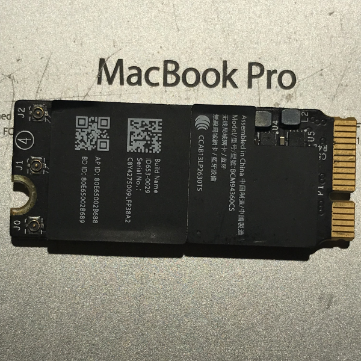

<h2 align="center" ><strong style="font-size: 36px;"> 🫴✨ Custom Arch Linux ISO with BCM4360 Support 🧙 </strong></h2>

<p align="center">
  
</p>

---

###  This guide provides a **step-by-step** process to create a custom Arch Linux ISO with 
# **Broadcom BCM4360 WiFi support**.

GitHub Repository: [archlinux-BCM4360_SUPPORT](https://github.com/SalDevX/archlinux-BCM4360_SUPPORT.git)

---

## **Clone the Repository**
Start by cloning the repository containing all necessary configurations:
```bash
❯ cd ~/Desktop
❯ git clone https://github.com/SalDevX/archlinux-BCM4360_SUPPORT.git
❯ cd archlinux-BCM4360_SUPPORT
```

---

## **Install Required Packages**
Ensure you have the necessary dependencies installed:
```bash
❯ sudo pacman -S archiso
```
---

## **Build the Custom ISO**  


Execute the following command inside the repository directory:

```bash

❯ cd ~/Desktop/archlinux-BCM4360_SUPPORT
❯ mkdir -p ~/archiso-tmp
❯ sudo chown -R $USER:$USER ~/archiso-tmp
❯ sudo mkarchiso -v -w ~/archiso-tmp -o ~/Desktop/custom-archiso .
```
This will generate the ISO in `~/Desktop/custom-archiso/`.

---


## <b>Burn the ISO to a USB Drive</b> 


### Use `dd` to flash the ISO onto a USB drive:
```bash
❯ sudo dd if=~/Desktop/custom-archiso/archlinux-BCM4360_SUPPORT.iso of=/dev/sdX bs=4M status=progress && sync
```

Replace `/dev/sdX` with your actual USB device (e.g., `/dev/sdb`). Alternatively, use a tool like **balenaEtcher** for a graphical interface.

---

## **Boot from USB**
- Insert the USB drive into your MacBook Pro 2014.
- Restart and hold down the **Option key** to select the boot device.
- Choose the custom **Arch Linux ISO** and proceed with installation.

---

## **The WiFi should work out of the**  


## **Troubleshooting**
### **WiFi Not Working?**
Try manually loading the driver:
```bash
❯ modprobe -r b43 ssb brcm80211 brcmfmac brcmsmac bcma
❯ modprobe wl
```
If needed, restart NetworkManager:
```bash
❯ systemctl restart NetworkManager
```

---


## **Done!** You now have a fully custom **Arch Linux ISO** with **Broadcom BCM4360 WiFi support**! 

# Network Setup in Live Installation

This guide explains how to set up networking **during the live installation** of the custom Arch Linux ISO with BCM4360 support.

---

## **Stop Mirror Service**
To prevent connectivity loops due to missing network access, stop the mirror service:
```bash
❯ systemctl stop reflector.service
❯ systemctl stop reflector.timer
```

---

## **Start NetworkManager**
Enable and start **NetworkManager** to manage WiFi connections:
```bash
❯ systemctl start NetworkManager
```

Verify available WiFi networks:
```bash
❯ nmcli device wifi list
```

---

## **Connect to WiFi**
Find your network's **UUID** from the list and use it to connect:
```bash
❯ nmcli device wifi connect <UUID> password <your_wifi_password>
```
Alternatively, connect using the **SSID**:
```bash
❯ nmcli device wifi connect "SSID_NAME" password "your_wifi_password"
```

Check if the connection is successful:
```bash
❯ nmcli connection show
```

---

## **Restart Mirror Service**
Once connected, restart the mirror service:
```bash
❯ systemctl start reflector.service
❯ systemctl start reflector.timer
```

---

## **Done!** You are now connected to WiFi and can proceed with the Arch Linux installation! 


For updates and contributions, visit [archlinux-BCM4360_SUPPORT](https://github.com/SalDevX/archlinux-BCM4360_SUPPORT.git).


Here's a sleek and fancy version with better readability and a modern touch:  

---

### 🚀 **Prebuilt Arch Linux ISO with Broadcom Support**  

If you don’t have the setup to build your own custom ISO, you can **download a prebuilt Arch Linux ISO** designed for MacBook Pro models from **2013 to 2015**.  

✅ **Includes:**  
- `broadcom-wl-dkms` for Wi-Fi support  
- Essential packages for a smooth live installation  

⚠️ **Compatibility Notice:**  
This ISO has been tested on **MacBook Pro (2013–2015) models** with Broadcom Wi-Fi. **Other models may have varying compatibility.**  

---

<br></br>


<p align="center">
    <a href="https://drive.google.com/uc?export=download&id=1T7eOPBnpQysCpjo_9NMvmkim7hK84Oin">
        
    </a>
</p>
<div align="center">
    <strong style="font-size: 20px;">Download with Cloud Drive</strong>
</div>


